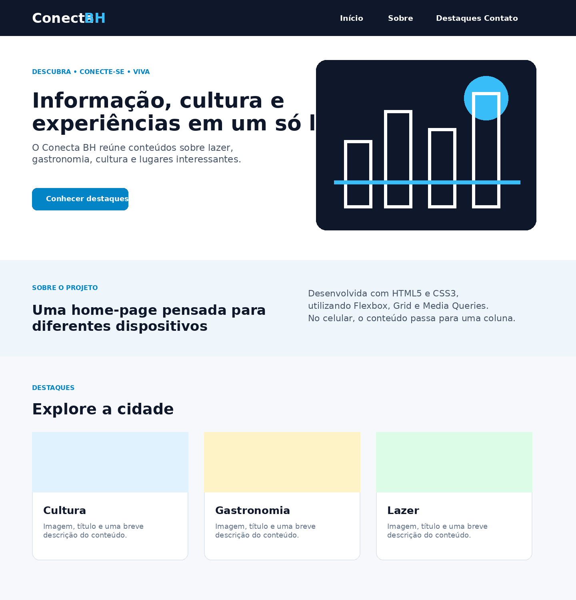
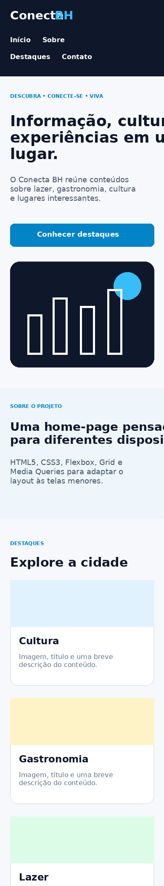

# Semana 05

Projeto acadêmico desenvolvido para a disciplina **Desenvolvimento de Interfaces Web**.

A proposta desta atividade foi evoluir a home-page criada anteriormente, aplicando conceitos de **HTML5**, **CSS3**, **Flexbox**, **CSS Grid**, **Media Queries** e **Viewport**, garantindo uma boa experiência de navegação tanto no desktop quanto em dispositivos móveis.

## Autor

- **Nome:** Lucas Manata
- **Curso:** Ciência da Computação
- **Instituição:** PUC Minas
- **Disciplina:** Desenvolvimento de Interfaces Web

> Antes de entregar, substitua **SEU NOME AQUI** pelo seu nome completo.

## Tecnologias utilizadas

- HTML5
- CSS3
- Flexbox
- CSS Grid
- Media Queries
- Git
- GitHub

## Estrutura do projeto

```text
projeto-home-responsiva/
├── home.html
├── css/
│   └── styles.css
├── img/
│   ├── banner.svg
│   ├── cultura.svg
│   ├── gastronomia.svg
│   └── lazer.svg
├── prints/
│   ├── desktop.png
│   └── mobile.png
└── README.md
```

## Elementos obrigatórios implementados

A home-page possui:

- Cabeçalho com nome do site e quatro links internos;
- Seção principal com banner e texto introdutório;
- Conteúdo dividido em duas colunas na versão desktop;
- Layout reorganizado em uma única coluna em telas menores;
- Seção secundária com três cards;
- Cada card possui imagem, título e descrição;
- Rodapé com links institucionais/redes sociais;
- Responsividade criada somente com CSS puro;
- Uso de Flexbox, Grid e Media Queries.

## Responsividade

### Desktop



### Mobile



## Como executar

Basta abrir o arquivo `home.html` no navegador.

Também é possível utilizar a extensão **Live Server** do Visual Studio Code.


## Observação

Este projeto não utiliza Bootstrap, Tailwind, Materialize, Foundation ou qualquer outro framework CSS.
