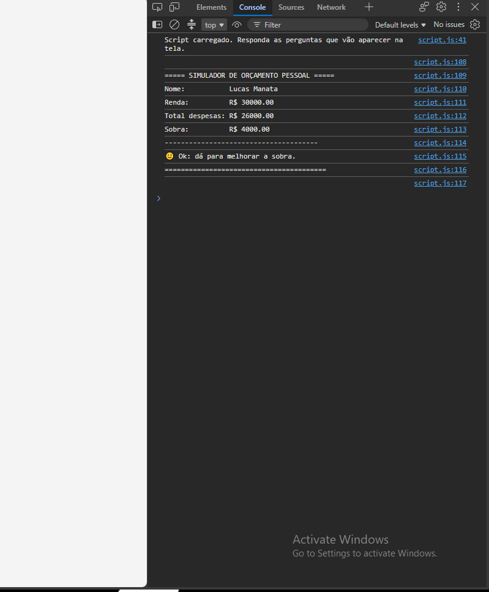

# Simulador de Orçamento Pessoal — JavaScript básico

Atividade prática da disciplina **Desenvolvimento de Interfaces Web** da **PUC Minas**, referente à **semana 07**.

O exercício introduz os primeiros passos em JavaScript no navegador, praticando
criação de variáveis, tipos básicos (`string`, `number`, `boolean`), operadores,
fluxos de controle condicionais (`if` / `else`) e estruturas de repetição (`for` e `while`).

A aplicação é um mini-simulador de orçamento pessoal: o usuário informa o nome, a
renda mensal e some despesas, e o script classifica o resultado do orçamento.

## Autor

- **Nome:** Lucas manata
- **Matrícula:** 910815
- **Curso:** Ciência da Computação
- **Instituição:** PUC Minas
- **Disciplina:** Desenvolvimento de Interfaces Web

## Tecnologias utilizadas

- HTML5
- JavaScript (ES5+, sem frameworks)
- DevTools / Console do navegador
- Git
- GitHub

## Estrutura de arquivos

```text
semana07/
├── index.html
├── script.js
├── README.md
└── prints/
    └── console.png
```

## Como executar

A atividade foi feita para rodar direto no navegador, sem servidor.

1. Abra a pasta `semana07` no Visual Studio Code;
2. Abra o arquivo `index.html` no navegador;
3. Abra o **Console do navegador com `F12`**;
4. Recarregue a página — o script roda sozinho e as perguntas aparecem na tela.

As respostas são digitadas nas janelas de `prompt()`. Ao final, o resultado é
mostrado em um `alert()` e também no console.

## Como o script foi feito

### 1) Dados iniciais

- O **nome** é lido como `string` com `prompt()`;
- A **renda mensal** e a **quantidade de despesas** são lidas como `number` e
  passadas pela validação com `while`;
- A quantidade de despesas é limitada entre 1 e 5: se for menor que 1 vira 1, e
  se for maior que 5 vira 5.

### 2) Validação com `while`

A função `perguntarNumero()` usa `Number(...)` e `isNaN(...)`. Enquanto o valor
digitado não for um número, o `while` repete a pergunta. Isso evita que um texto
como `"abc"` entre no cálculo e produza `NaN`.

```js
let valor = Number(prompt(mensagem));

while (isNaN(valor)) {
    console.warn("Entrada inválida (" + valor + "). Digite um número.");
    valor = Number(prompt("Valor inválido! Digite um número. " + mensagem));
}
```

### 3) Lançamento das despesas com `for`

Um `for` pergunta o valor de cada despesa ("Despesa 1", "Despesa 2", ...) e
acumula o total com o operador `+=`.

### 4) Análise com `if` / `else`

A sobra é calculada com `renda - totalDespesas`, e a comparação
`totalDespesas > renda` é guardada em uma variável **boolean** chamada `gastouMais`.

| Situação | Mensagem |
| --- | --- |
| `despesas > renda` | ⚠️ Atenção: você gastou mais do que ganhou. |
| `sobra >= 30%` da renda | ✅ Ótimo: boa margem de sobra. |
| caso contrário | 🙂 Ok: dá para melhorar a sobra. |

### 5) Saída final

O resultado mostra nome, renda, total de despesas e sobra, todos com duas casas
decimais (`toFixed(2)`), e é exibido de duas formas:

- em um `alert()`;
- no console, com `console.log()`, em um texto organizado e delimitado por
  linhas de tracejado.

## Print da execução

Print do Console do navegador com o resultado do `console.log`:



## Git

```bash
git checkout -b lucas
git add .
git commit -m "Atividade Prática - JavaScript básico - matrícula: 910815"
git push origin main
git push origin lucas
```
